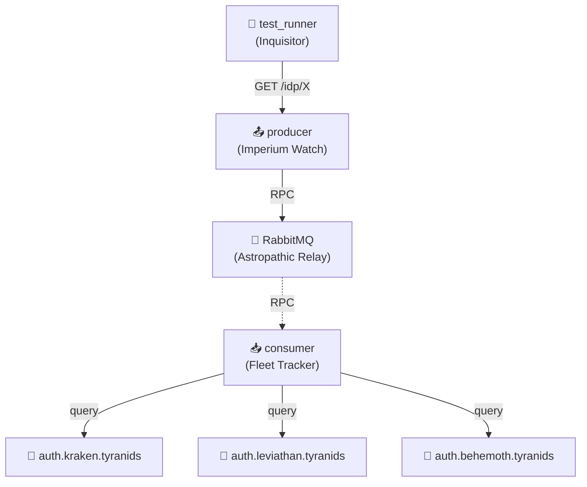

# IDP Cascading Failures

🦂 **Tyranid Hive Fleets**: System resilience when multiple bio-mass authentication tendrils fail.

## Architecture

## What This Tests

⚠️ **No tests implemented yet**

Tests system behavior when 1, 2, or all 3 Hive Fleet IdPs fail. Validates aggregated health reflects Tyranid bio-mass assimilation state correctly. Your biomass is now our password.

## For Newcomers

**Identity Providers (IdPs):** Services that authenticate users (like Google Login, GitHub Login, etc.)

**This Example:**

- **3 separate IdP services**, each with their own domain:
  - `auth.kraken.tyranids` - Hive Fleet Kraken authentication service
  - `auth.leviathan.tyranids` - Hive Fleet Leviathan authentication service
  - `auth.behemoth.tyranids` - Hive Fleet Behemoth authentication service
- **Producer** sends health check requests via RPC (Remote Procedure Call) to **Consumer**
- **Consumer** queries each IdP and reports back
- Tests what happens when multiple IdPs become unavailable (cascading failures)
