# IDP Cascading Failures

🦂 **Tyranid Hive Fleets**: System resilience when xenos bio-authentication swarms are exterminated.

## Architecture

```mermaid
graph TB
    test["🧪 test_runner<br/>(Inquisitor)"]
    producer["📤 producer<br/>(Watch Fortress)"]
    consumer["📥 consumer<br/>(Fleet Scanner)"]
    rabbitmq["🐰 RabbitMQ<br/>(Astropathic Relay)"]
    kraken["👾 auth.kraken.tyranids"]
    leviathan["👾 auth.leviathan.tyranids"]
    behemoth["👾 auth.behemoth.tyranids"]

    test -->|GET /idp/X| producer
    producer -->|RPC| rabbitmq
    rabbitmq -.->|RPC| consumer
    consumer -->|query| kraken
    consumer -->|query| leviathan
    consumer -->|query| behemoth
```

## What This Tests

**Three xenos authentication swarms threaten Holy Terra's login screens!**

System validates resilience when multiple Tyranid Hive Fleet IdPs are operational. Tests 3 IdPs (Kraken, Leviathan, Behemoth) responding to RPC health checks. All fleets return bio-mass consumption confirmations (200 OK). "Your password is now our password."

**Cascading failure logic** (majority voting for `/idp/internet` endpoint):

- **3/3 up** → 200 OK (majority healthy)
- **2/3 up** → 200 OK (majority healthy)
- **1/3 up** → 503 Service Unavailable (majority failed)
- **0/3 up** → 503 Service Unavailable (all failed)

**Note:** Dynamic failure scenarios tested in unit tests at `monitoring-idp-producer/src/server/router.test.ts`

## For Newcomers

**Cascading Failures:** When multiple systems fail in sequence or simultaneously (like dominos falling)

**This Example:**

- **3 healthy Tyranid Hive Fleet IdPs:**
  - `auth.kraken.tyranids` - Hive Fleet Kraken (returns 200 with "Feeding on your biomass...")
  - `auth.leviathan.tyranids` - Hive Fleet Leviathan (returns 200 with "Assimilation protocols active")
  - `auth.behemoth.tyranids` - Hive Fleet Behemoth (returns 200 with "Your password is now our password")
- **Producer** queries via RPC, **Consumer** checks each Hive Fleet
- Tests aggregated health endpoint (`/idp/internet`) with multiple IdPs
- Validates majority-voting logic (service returns 503 when majority of IdPs fail)
- Individual IdP queries work through RPC pattern
- Unknown IdP names properly return 404
