```mermaid
graph TB
    test["🧪 test_runner"]
    producer["📤 producer"]
    consumer["📥 consumer"]
    rabbitmq["🐰 RabbitMQ"]
    mock["🎭 mock-idp<br/>primary<br/>secondary<br/>tertiary"]

    test -->|GET /idp/X| producer
    producer -->|RPC| rabbitmq
    rabbitmq -.->|RPC| consumer
    consumer -->|query| mock
```

# IDP Cascading Failures

Demonstrates system behavior when multiple IDPs fail simultaneously or in sequence.

## Architecture

## Purpose

Validate system resilience when multiple Identity Providers fail:

- **Sequential failures**: IDPs fail one after another
- **Cascading impact**: How one failure affects overall health
- **Aggregated status**: System response when majority of IDPs are down
- **Recovery behavior**: System behavior when IDPs come back online

## Test Scenarios (Not Yet Implemented)

1. **Single IDP failure**: One IDP down, others healthy
2. **Multiple failures**: 2/3 IDPs failing
3. **Total failure**: All IDPs unavailable
4. **Partial recovery**: Some IDPs recover
5. **Timeout handling**: Slow-responding IDPs

## Services

- **test_runner**: Test client making HTTP requests
- **producer**: RPC server aggregating IDP health
- **consumer**: RPC worker executing health checks
- **rabbitmq**: Message broker for RPC
- **mock-idp**: nginx serving multiple IDP endpoints with different behaviors
