# IDP Cascading Failures

🦂 **Tyranid Hive Fleets**: System resilience when xenos bio-authentication swarms are exterminated.

## Architecture

```mermaid
graph TB
    test["🧪 test_runner<br/>(Inquisitor)"]
    producer["📤 producer<br/>(Watch Fortress)"]
    consumer["📥 consumer<br/>(Fleet Scanner)"]
    rabbitmq["🐰 RabbitMQ<br/>(Astropathic Relay)"]
    kraken["👾 auth.kraken.tyranids"]
    leviathan["👾 auth.leviathan.tyranids"]
    behemoth["👾 auth.behemoth.tyranids"]

    test -->|GET /idp/X| producer
    producer -->|RPC| rabbitmq
    rabbitmq -.->|RPC| consumer
    consumer -->|query| kraken
    consumer -->|query| leviathan
    consumer -->|query| behemoth
```



## What This Tests

**Cascading Failure Resilience**: System validates behavior when multiple IdPs fail simultaneously.

This example demonstrates the monitoring system's resilience when Identity Providers become unavailable. Tests progressively stop Tyranid Hive Fleet IdPs (Kraken, Leviathan, Behemoth) and validates the system's majority voting logic.

### Test Scenarios

1. **All operational (3/3)**: All Hive Fleets responding → Returns 200 OK
2. **Partial failure (2/3)**: Behemoth stopped → Returns 200 OK (majority healthy)
3. **Minority operational (1/3)**: Behemoth + Leviathan stopped → Returns 503 (majority failed)
4. **Total failure (0/3)**: All stopped → Returns 503 (all failed)

### Technical Implementation

**Majority Voting Logic** on `/idp/internet` endpoint:

```typescript
status(unsucessfuls.length < successfuls.length ? 200 : 503);
```

**Fetch Error Handling**:

- Uses `AbortSignal.timeout(HTTP_TIMEOUT)` for network requests
- Catches fetch errors (network failures) and returns `status: 0`
- Filters responses: `status >= 200 && status < 400` = successful

**Configuration**:

- `HTTP_TIMEOUT=100ms` for fast failure detection in tests
- Sequential test execution: stop service → verify behavior

## Key Concepts

**Cascading Failures**: When multiple systems fail in sequence or simultaneously (like dominos falling).

**Majority Voting**: System health determined by whether more than half of dependencies are operational. Prevents false positives when minority of services fail.

**Services**:

- **3 Tyranid Hive Fleet IdPs** (mock authentication services):
  - `auth.kraken.tyranids` - Returns 200 with "Feeding on your biomass..."
  - `auth.leviathan.tyranids` - Returns 200 with "Assimilation protocols active"
  - `auth.behemoth.tyranids` - Returns 200 with "Your password is now our password"
- **Producer**: Exposes `/idp/internet` aggregated health endpoint
- **Consumer**: Performs RPC health checks via RabbitMQ

**Test Flow**:

1. Verify all 3 IdPs healthy via individual RPC calls (`/idp/kraken`, `/idp/leviathan`, `/idp/behemoth`)
2. Verify aggregated health returns 200 when all operational
3. Progressively stop services and verify majority voting:
   - Stop 1 service → Still returns 200 (2/3 majority)
   - Stop 2nd service → Returns 503 (1/3 minority)
   - Stop 3rd service → Returns 503 (0/3 all failed)
