# IDP Cascading Failures

System resilience when multiple IDPs fail.

```mermaid
graph TB
    test["🧪 test_runner"]
    producer["📤 producer"]
    consumer["📥 consumer"]
    rabbitmq["🐰 RabbitMQ"]
    mock["🎭 mock-idp<br/>primary<br/>secondary<br/>tertiary"]

    test -->|GET /idp/X| producer
    producer -->|RPC| rabbitmq
    rabbitmq -.->|RPC| consumer
    consumer -->|query| mock
```

## What This Tests

⚠️ **No tests implemented yet**

Will test system behavior when 1, 2, or all 3 IDPs fail. Validates aggregated health reflects failure state correctly.
