# IDP Error Handling

Graceful handling when IDPs return errors.

```mermaid
graph TB
    test["🧪 test_runner"]
    producer["📤 producer"]
    consumer["📥 consumer"]
    rabbitmq["🐰 RabbitMQ"]
    mock["🎭 mock-idp<br/>200/500/404"]

    test -->|GET /idp/X| producer
    producer -->|RPC| rabbitmq
    rabbitmq -.->|RPC| consumer
    consumer -->|query| mock
```

## What This Tests

System handles IDP errors correctly: 200 (healthy), 500 (server error), 404 (not found). Aggregated health endpoint shows mixed success/failure states.
