# IDP Error Handling

🐺 **Space Wolves vs Thousand Sons**: Graceful handling when Warp-corrupted IdPs return errors.

## Architecture

```mermaid
graph TB
    test["🧪 test_runner<br/>(Chapter Serf)"]
    producer["📤 producer<br/>(Auth Monitor)"]
    consumer["📥 consumer<br/>(IdP Checker)"]
    rabbitmq["🐰 RabbitMQ<br/>(Vox Network)"]
    fenris["🐺 auth.fenris.spacewolves<br/>(200)"]
    prospero["🔮 auth.prospero.thousandsons<br/>(500)"]
    sorcerers["🌀 auth.sorcerers.thousandsons<br/>(404)"]

    test -->|GET /idp/X| producer
    producer -->|RPC| rabbitmq
    rabbitmq -.->|RPC| consumer
    consumer -->|query| fenris
    consumer -->|query| prospero
    consumer -->|query| sorcerers
```

## What This Tests

Mead-fueled authentication vs Warp-corrupted sorcery. System handles: 200 (Fenris - loyal wolves), 500 (Prospero - Rubric corruption), 404 (Sorcerers - lost in Warp). Russ smashed the corrupted server with an axe.

## For Newcomers

**Error Handling:** How the system responds when IdPs return different HTTP status codes

**This Example:**

- **3 IdP services with different behaviors:**
  - `auth.fenris.spacewolves` - Returns **200 OK** (healthy, working correctly)
  - `auth.prospero.thousandsons` - Returns **500 Internal Server Error** (server broken)
  - `auth.sorcerers.thousandsons` - Returns **404 Not Found** (service unavailable/missing)
- **Producer** queries via RPC, **Consumer** attempts to reach each IdP
- Tests that the monitoring system correctly handles and reports different error states
- Aggregated health endpoint shows mixed success/failure states
