# IDP Error Handling

Graceful handling of various error scenarios in distributed IDP monitoring.

## Architecture

```mermaid
graph TB
    test["🧪 test_runner"]
    producer["📤 producer"]
    consumer["📥 consumer"]
    rabbitmq["🐰 RabbitMQ"]

    subgraph idps["Mock IDPs"]
        healthy["✅ /idp/healthy<br/>returns 200"]
        error["⚠️ /idp/error<br/>returns 500"]
        notfound["❌ /idp/not-found<br/>returns 404"]
    end

    test -->|curl /idp/X| producer
    producer -->|RPC query| rabbitmq
    consumer -->|subscribe| rabbitmq
    consumer -->|query| healthy
    consumer -->|query| error
    consumer -->|query| notfound
```

## Purpose

Validate producer gracefully handles various error responses from IDPs including:

- **Healthy responses** (200 OK)
- **Server errors** (500)
- **Not found errors** (404)
- **Aggregated health** showing mixed success/failure states

## Test Flow

1. **Setup**: Start services
2. **Service Status**: Verify producer and consumer are running
3. **Healthy IDP**: Test successful RPC to healthy endpoint
4. **Error IDP**: Test RPC to endpoint returning 500
5. **Not Found**: Test RPC to endpoint returning 404
6. **Aggregated Health**: Verify `/idp/internet` shows mixed results

## Services

- **test_runner**: Test client
- **producer**: RPC server aggregating IDP health
- **consumer**: Service querying mock IDPs
- **rabbitmq**: Message broker for RPC
- **mock-idp**: Nginx serving multiple endpoints with different status codes
