```mermaid
graph TB
    test["🧪 test_runner"]
    producer["📤 producer"]
    consumer["📥 consumer"]
    rabbitmq["🐰 RabbitMQ"]
    mock["🎭 mock-idp<br/>test-idp<br/>another-idp"]

    test -->|GET /idp/X| producer
    producer -->|RPC| rabbitmq
    rabbitmq -.->|RPC| consumer
    consumer -->|query| mock
```

# IDP Health Check RPC

Basic RPC-based health monitoring.

## What This Tests

Producer queries consumer via RPC to check IDP health. Tests individual IDP queries, aggregated health endpoint, and 404 handling for unknown IDPs.
