# IDP Health Check RPC

⚔️ **Dark Angels**: Basic RPC-based authentication monitoring with secrets.

## Architecture

```mermaid
graph TB
    test["🧪 test_runner<br/>(Interrogator-Chaplain)"]
    producer["📤 producer<br/>(Watchers)"]
    consumer["📥 consumer<br/>(Unforgiven)"]
    rabbitmq["🐰 RabbitMQ<br/>(Encrypted Vox)"]
    rock["🏰 auth.rock.darkangels"]
    caliban["🌍 auth.caliban.darkangels"]

    test -->|GET /idp/X| producer
    producer -->|RPC| rabbitmq
    rabbitmq -.->|RPC| consumer
    consumer -->|query| rock
    consumer -->|query| caliban
```

## What This Tests

Secrets kept encrypted via RPC. Producer queries consumer through secure vox-network to check Dark Angels fortress-monastery IdPs (The Rock) and homeworld IdPs (Caliban). "Delete your browser history, battle-brother."

## For Newcomers

**RPC (Remote Procedure Call):** A way for one service to call functions on another service over a network

**This Example:**

- **2 healthy IdP services:**
  - `auth.rock.darkangels` - The Rock fortress-monastery authentication
  - `auth.caliban.darkangels` - Caliban homeworld authentication
- **Producer** exposes HTTP endpoints that trigger RPC calls to **Consumer**
- **Consumer** actually queries the IdPs and sends results back via RPC
- Tests basic RPC-based health monitoring pattern
- Also tests 404 handling for unknown IdPs
- Demonstrates request/response pattern through message queue (RabbitMQ)
