# IDP Health Check RPC

End-to-end distributed health monitoring with RPC communication.

## Architecture

```mermaid
graph TB
    test["🧪 test_runner"]
    producer["📤 producer"]
    consumer["📥 consumer"]
    rabbitmq["🐰 RabbitMQ"]
    mock["🎭 mock-idp<br/>test-idp<br/>another-idp"]

    test -->|GET /idp/X| producer
    producer -->|RPC| rabbitmq
    rabbitmq -.->|RPC| consumer
    consumer -->|query| mock
```

## Purpose

Validate end-to-end RPC communication between producer and consumer for distributed health monitoring:

- **Basic health**: Verify `/` endpoint
- **IDP queries**: Test RPC-based IDP health checks
- **Aggregated health**: Show overall health status from multiple IDPs
- **Unknown endpoints**: Handle 404 for unknown IDPs

## Test Flow

1. **Setup**: Start producer and consumer connected to RabbitMQ
2. **Consumer Ready**: Wait for consumer to connect and parse IDP mappings
3. **Producer Ready**: Wait for producer to connect and create RPC queues
4. **Health Check**: Test root endpoint
5. **RPC Queries**: Test individual IDP health checks via RPC
6. **Aggregated Health**: Test overall health aggregation
7. **Error Handling**: Test unknown IDP requests

## Services

- **test_runner**: Test client making HTTP requests
- **producer**: RPC server accepting health check requests
- **consumer**: RPC worker executing health checks against mock IDPs
- **rabbitmq**: Message broker enabling RPC pattern
- **mock-idp**: Nginx serving multiple IDP health endpoints
