# IDP Proxy Middleware

Split-network architecture demonstrating internet↔intranet boundary with middleware proxy.

## Architecture

```mermaid
graph TB
    test["🧪 test_runner"]
    producer["📤 producer"]
    mock_ext["🎭 mock_idp_external"]
    rabbitmq["🐰 RabbitMQ"]

    subgraph intranet["🔒 Intranet"]
        consumer["📥 consumer"]
        mock_int["🎭 mock_idp_internal"]
    end

    test -->|GET /idp/X| producer
    producer -->|query| mock_ext
    producer -->|RPC| rabbitmq
    rabbitmq -.->|RPC| consumer
    consumer -->|query| mock_int
```

## Purpose

Validate producer can serve requests through a proxy gateway while communicating with consumer across network boundaries via message broker.

## Test Flow

1. **Setup**: Start services with split networks
2. **Producer Health**: Verify producer responds to direct queries
3. **IDP Queries**: Test producer's ability to query external IDPs
4. **RPC Communication**: Verify producer can reach consumer via RabbitMQ for intranet IDP queries
5. **Cross-Network**: Confirm split-network isolation is maintained
6. **Concurrent**: Ensure multiple simultaneous requests succeed

## Services

- **test_runner**: Internet-facing test client (curl-based)
- **producer**: RPC server querying external IDPs and consumer
- **consumer**: Isolated service querying internal IDPs via RPC
- **proxy**: nginx reverse proxy forwarding requests to producer
- **mock_idp_external**: External IDP endpoints
- **mock_idp_internal**: Internal IDP endpoints (intranet only)
- **rabbitmq**: Message broker (accessible from both networks)
