```mermaid
graph TB
    test["🧪 test_runner"]
    producer["📤 producer"]
    mock_ext["🎭 mock_idp_external"]
    rabbitmq["🐰 RabbitMQ"]

    subgraph intranet["🔒 Intranet"]
        consumer["📥 consumer"]
        mock_int["🎭 mock_idp_internal"]
    end

    test -->|GET /idp/X| producer
    producer -->|query| mock_ext
    producer -->|RPC| rabbitmq
    rabbitmq -.->|RPC| consumer
    consumer -->|query| mock_int
```

# IDP Proxy Middleware

Monitoring IDPs across network boundaries using split-network architecture.

## What This Tests

Producer monitors both internet and intranet IDPs while maintaining network isolation. Internet requests query external IDPs directly; intranet requests use RPC to reach isolated consumer.
