# IDP Proxy Middleware

🏰 **Imperial Fists vs Iron Warriors**: Monitoring IdPs across fortress walls using split-network architecture.

## Architecture

```mermaid
graph TB
    test["🧪 test_runner<br/>(Battlefield Observer)"]
    producer["📤 producer<br/>(External Monitor)"]
    olympia["🔨 auth.olympia.ironwarriors"]
    medrengard["⚔️ auth.medrengard.ironwarriors"]
    proxy["🚪 proxy"]
    rabbitmq["🐰 RabbitMQ<br/>(Fortified Vox)"]

    subgraph fortress["🏰 fortress-network"]
        consumer["📥 consumer<br/>(Internal Monitor)"]
        phalanx["🛡️ auth.phalanx.imperialfists"]
        inwit["🏛️ auth.inwit.imperialfists"]
    end

    test -->|":8080/idp/X"| proxy
    proxy -->|"/idp/X"| producer
    producer -->|query| olympia
    producer -->|query| medrengard
    producer -->|RPC| rabbitmq
    rabbitmq -.->|RPC| consumer
    consumer -->|query| phalanx
    consumer -->|query| inwit
```

## What This Tests

**Loyalists behind fortress walls, heretics exposed to the siege!**

Producer (on public network) monitors:

- **Iron Warriors IdPs** (Olympia, Medrengard) - **DIRECT access** - heretic siege artillery exposed to internet
- **Imperial Fists IdPs** (Phalanx, Inwit) - **RPC only** - loyalist fortress auth protected behind walls

Only the consumer inside the fortress network can query the Imperial Fists IdPs. Producer must use RPC to reach them. Dorn's auth has 99.999% uptime; Perturabo's is eternal DDoS rage.

## For Newcomers

**Network Isolation:** Separating services into different networks for security (like DMZ vs internal network)

**This Example:**

- **4 IdP services split across 2 networks:**

  **Public Network (Internet):**
  - `auth.olympia.ironwarriors` - External IdP (Producer queries DIRECTLY)
  - `auth.medrengard.ironwarriors` - External IdP (Producer queries DIRECTLY)

  **Fortress Network (Intranet/Private):**
  - `auth.phalanx.imperialfists` - Internal IdP (Producer uses RPC via Consumer)
  - `auth.inwit.imperialfists` - Internal IdP (Producer uses RPC via Consumer)

- **Producer** can directly HTTP query external Iron Warriors IdPs
- **Producer** CANNOT directly reach Imperial Fists IdPs (network isolation)
- **Producer** must use RPC through RabbitMQ to ask **Consumer** to query them
- **Consumer** lives inside fortress network and can reach Imperial Fists IdPs
- Tests monitoring across network boundaries (simulates internet vs intranet split)
