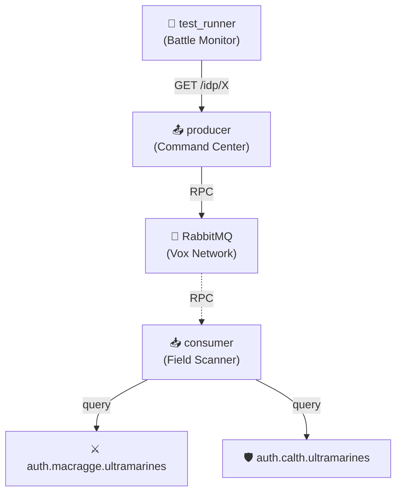

# IDP Resilience

⚔️ **Ultramarines**: Testing system resilience under infrastructure failures and recovery.

## Architecture

## What This Tests

**Infrastructure Resilience**: System graceful degradation when RabbitMQ fails.

This example validates the monitoring system's partial degradation pattern:

### Test Scenarios

1. **Baseline**: All services operational, both RPC and direct checks work
2. **RabbitMQ Failure**: Stop RabbitMQ → RPC timeouts → Direct checks still work

### Key Insights

**Partial Degradation**: When RabbitMQ fails:

- ✅ `/idp/internet` (direct HTTP checks) continues working
- ❌ `/idp/:name` (RPC-based checks) returns 503 timeout

**Graceful Failure**: RPC calls timeout gracefully (503) instead of hanging indefinitely

**System Resilience**: Producer maintains direct IdP monitoring even when message broker is down

## Services

- **2 Ultramarines IdPs** (mock authentication services):
  - `auth.macragge.ultramarines` - "Courage and Honour!"
  - `auth.calth.ultramarines` - "We march for Macragge!"
- **Producer**: Exposes HTTP endpoints for health checks
- **Consumer**: Processes RPC requests via RabbitMQ
- **RabbitMQ**: Message broker for RPC communication

## Test Flow

1. Verify all services start and RPC works correctly
2. **Stop RabbitMQ** → RPC fails, direct checks work
3. **Restart RabbitMQ** → RPC recovers automatically
4. **Stop Consumer** → RPC fails, direct checks work
5. **Restart Consumer** → RPC recovers automatically
