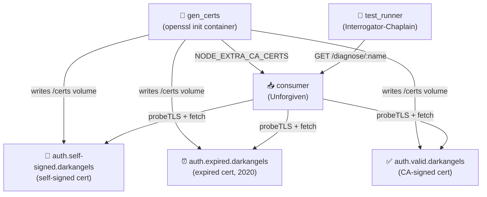

# IDP TLS Diagnostic

⚔️ **Dark Angels**: TLS certificate chain inspection for IdP endpoints.

## Architecture



## What This Tests

Direct consumer-side diagnostic endpoint — no RPC, no producer, no RabbitMQ. The consumer connects to each IdP with a raw TLS socket (`rejectUnauthorized: false`) to capture the full certificate chain regardless of validity, then runs a normal `fetch` to report the HTTP status.

| IdP | Certificate | Expected |
|-----|-------------|----------|
| `self-signed` | Self-signed (not CA-backed) | `authorized: false`, `DEPTH_ZERO_SELF_SIGNED_CERT`, chain length 1, HTTP fails |
| `expired` | CA-signed but validity window in Jan 2020 | `authorized: false`, `CERT_HAS_EXPIRED`, chain length 2, HTTP fails |
| `incomplete-chain` | Signed by intermediate CA, intermediate omitted from server chain | `authorized: false`, `UNABLE_TO_VERIFY_LEAF_SIGNATURE`, chain length 1, HTTP fails |
| `valid` | Signed directly by root CA | `authorized: true`, chain length 2, HTTP 200 |

The test CA is injected into the consumer via `NODE_EXTRA_CA_CERTS` so the valid cert is trusted.

## Response Shape

```json
{
  "url": "https://auth.valid.darkangels",
  "http": {
    "status": 200,
    "headers": { "content-type": "application/json", "..." : "..." }
  },
  "tls": {
    "authorized": true,
    "authorization_error": null,
    "chain": [
      {
        "subject": { "CN": "auth.valid.darkangels" },
        "issuer": { "CN": "Dark Angels Test CA" },
        "valid_from": "...",
        "valid_to": "...",
        "fingerprint_256": "...",
        "serial_number": "..."
      },
      {
        "subject": { "CN": "Dark Angels Test CA" },
        "issuer": { "CN": "Dark Angels Test CA" },
        "..."
      }
    ]
  }
}
```

When TLS validation fails, `http.error` is populated instead of `http.status` and `http.headers`.

## For Newcomers

**Why `rejectUnauthorized: false`?** The TLS probe bypasses strict validation so it can *always* retrieve the certificate chain and report what it found — useful when you need to diagnose *why* a cert is rejected (wrong CA, expired, wrong CN…) rather than just getting a connection error.

**`NODE_EXTRA_CA_CERTS`:** A Node.js/Bun environment variable that appends extra CA certificates to the default trust store without replacing it. Used here to make the consumer trust the dynamically-generated test CA.
